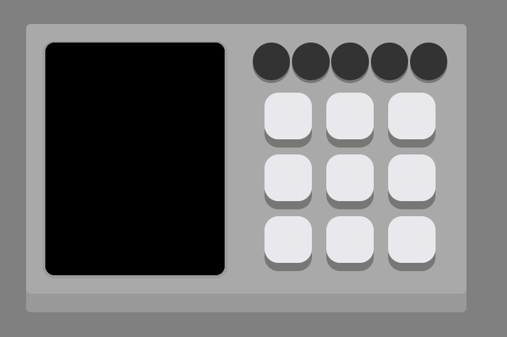
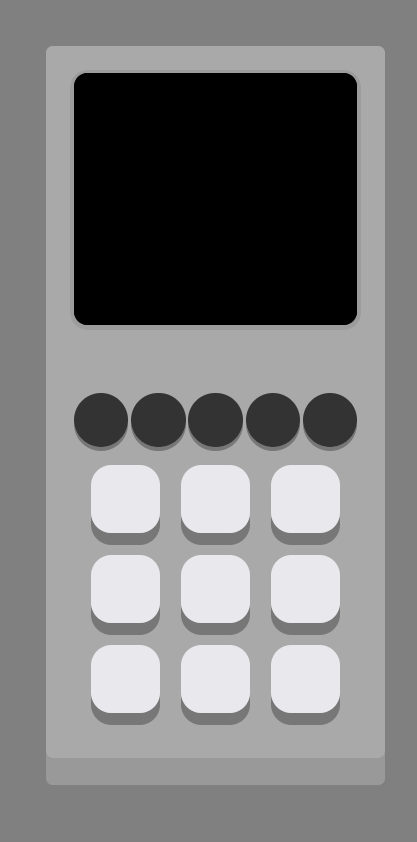

## Among Us - Reator

O Projeto faz parte do curso na plataforma da Digital Innovation One:

__*Criando seu jogo de memória estilo Genius*__

O Projeto coloca em prática tudo aprendido durante o curso. Ao inves de criar um Genius, eu resolvi recriar o minigame Start Reactor do Among Us. Utilizando Flexbox com grid para manter uma boa responsividade.

 

## Imagens

#### PC:

#### Mobile:

